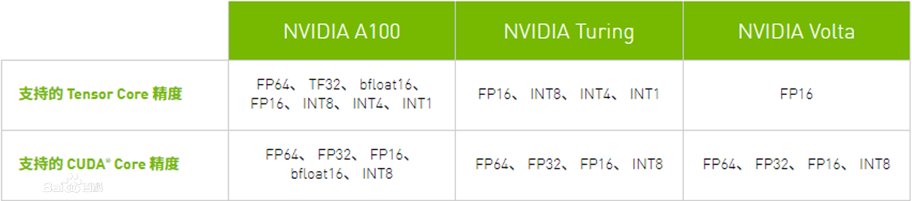
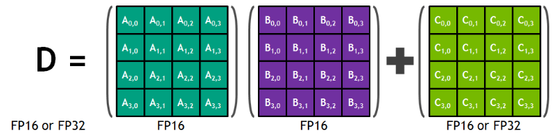
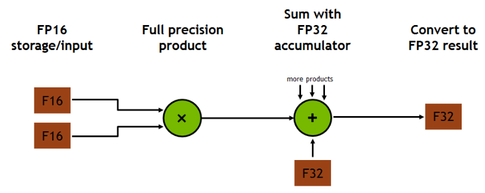

# Tensor Core Learning

## 基本概念
Tensor Core 是 NVIDIA 推出的一种 GPU 架构，它专门用于计算矩阵运算。Tensor Core 可以提供高效的半精度运算，这在深度学习和 AI 领域非常有用。Tensor Core 可以实现矩阵乘法和矩阵加法，这些运算在深度学习中非常常见。

Tensor Core 可以大幅提高深度学习模型的训练速度和推理速度。它可以支持各种类型的网络，包括 CNN，RNN 和 GAN。Tensor Core 还可以用于其他类型的矩阵运算，例如线性代数和信号处理。

## Tensor Core 的架构和特性
Tensor Core 的架构包括专门的矩阵乘法单元 (MMA) 和矩阵加法单元 (MMA)。这些单元可以在半精度浮点数 (FP16) 上运行，这使得它们能够在精度和性能之间取得平衡。

在性能方面，Tensor Core 可以提供高达 12 个 TFLOPS 的矩阵乘法性能和 24 个 TFLOPS 的矩阵加法性能。这使得它能够大幅加速深度学习模型的训练和推理。

Tensor Core 还支持其他类型的矩阵运算，例如矩阵转置，矩阵乘法和矩阵加法。这使得它可以用于各种类型的应用，包括深度学习，线性代数和信号处理。

## Tensor Core 在深度学习中的应用
在深度学习中，Tensor Core 用来加速训练和推理过程。
- 在训练中，Tensor Core 可以帮助更快地进行大量矩阵运算，如卷积运算和矩阵乘法，从而加快模型的训练速度。
- 在推理中，Tensor Core 可以帮助更快地进行大量矩阵运算，并且可以在线性时间内完成运算，这使得实时性能更高，更适合实时应用。
- Tensor Core 也支持更高的精度，比如 FP16 和 bfloat16，这使得训练更稳定，模型的性能也更好。

## Tensor Core 与 GPU 和 CPU 的比较
与 GPU 或 CPU 相比，Tensor Core 在矩阵运算性能上有明显优势。
- 与 GPU 相比，Tensor Core 可以在同样的时间内处理更多的矩阵运算，并且支持更高的精度，这使得它在深度学习中的性能表现更佳。
- 与 CPU 相比，Tensor Core 在矩阵运算性能上有更高的并行性和更快的速度，这使得它在训练和推理大规模深度学习模型时更加高效。
- 但是 Tensor Core 主要是用于矩阵运算，对于其他运算，性能可能不如其他 GPU 或 CPU。

## Tensor Core 的可用性
- **第一代 Tensor Core ：NVIDIA Volta 架构：** 通过 FP16 和 FP32 下的混合精度矩阵乘法提供了突破性的性能；
- **第二代 Tensor Core ：NVIDIA Turing 架构：** Turing Tensor Core 提供了一系列用于深度学习训练和推理的精度（从 FP32 到 FP16 再到 INT8 和 INT4），Turing 架构也在消费级 GeForce 产品线上配备 Tensor Core ，另 GeForce RTX 20 系列显卡具备了全新的 AI 硬件加速计算能力；
- **第三代 Tensor Core ：NVIDIA Ampere 架构：** 可覆盖研究人员需要的全系列精度（TF32、FP64、FP16、INT8 和 INT4），从而加速和简化 AI 的采用，并将 NVIDIA Tensor Core 的强大功能扩展到 HPC 领域。



## Tensor Core 运算操作
每个 Tensor Core 提供一个 4x4x4 矩阵处理阵列，执行操作 D=A*B+C，其中 A、B、C 和 D 是 4×4 矩阵，如下图所示。矩阵乘法输入 A 和 B 是 FP16 矩阵，而累加矩阵 C 和 D 可以是 FP16 或 FP32 矩阵。


每个 Tensor Core 每个时钟周期执行 64 个浮点 FMA 混合精度操作（FP16 输入乘以全精度乘积，FP32 累加）。
SM（流处理器）中的 8 个 Tensor 核心每个时钟周期总共执行 1024 个浮点操作。

如下图所示，对于 4x4x4 矩阵乘法，FP16 乘法产生全精度结果，该结果在 FP32 运算中与给定点积中的其他乘积累加。




## Tensor Core 调用

### 简介
利用 Tensor Core 实现矩阵乘法的加速，一般有如下两种方式：
- 可以利用现成库函数，最新版本的 cuDNN 7.0、CUDA9.0 中的 cuBLAs，TensorRT 3.0 都支持 Tensor Core 的调用。*（该方式相对简单。）*
- 在 CUDA 编程里实现 Tensor Core 的调用。新的 CUDA 9.0 里增加了 WMMA ，可以调用其中的API实现输入矩阵的 Load ，两个矩阵做乘加，还有结构矩阵的 Store 。*（该方式相对复杂，但是更底层的实现，更符合我们的需求。）*

### 代码示例
以下是使用 WMMA 调用 Tensor Core 进行计算的示例。Tensor Cores 的调用 API 在nvcuda::wmma 命名空间里。通过调用 API 进行数值初始化，进行矩阵乘加（MMA）操作然后再把数值存回内存。*具体见注释。*

``` c++
// 头文件 和 命名空间
#include<mma.h>
Using namespace nvcuda;


// The only dimensions currently supported by WMMA
// 单次 16*16 矩阵的乘法和累加称为 wmma 操作。
const int WMMA_M = 16;
const int WMMA_N = 16;
const int WMMA_K = 16;
 
__global__ void wmma_example(half *a, half *b, float *c, 
                             int M, int N, int K, 
                             float alpha, float beta) 
{
    // 定义wmma在各个方向上的维度（实际上就是单次计算的小矩阵（tile）的size）
    // Leading dimensions. Packed with no transpositions.
    int lda = M;        // 矩阵 A 的行数
    int ldb = K;        // 矩阵 A 的行数
    int ldc = M;        // A 的列数(即 B 的行数)

    // 【注意！】A,B的 size不局限于16*16，因为 16*16 只是单次 wmma 可运算的矩阵大小，而通过多个 warp（ SM 中的基本执行代码单元，包含 32 个 thread ）和循环实现更大 size 的矩阵运算。
    
    // Tile using a 2D grid
    int warpM = (blockIdx.x * blockDim.x + threadIdx.x) / warpSize;
    int warpN = (blockIdx.y * blockDim.y + threadIdx.y);

    // 声明 fragment 变量
    // Declare the fragments
    // fragement变量用于对应一次wmma操作中的小矩阵块，声明时所填的参数表明了该fragment在计算中的用途和角色
    
    // 声明规则如下。
    // wmma::fragment<wmma 矩阵类型, （WMMA_M, WMMA_N, WMMA_K）三个参数用于表述数据的维度形状 , 矩阵数据类型（精度）, wmma 存储类型（可选）> 变量名;

    // 用于乘法的 matrix_a 和 matrix_b
    wmma::fragment<wmma::matrix_a, WMMA_M, WMMA_N, WMMA_K, half, wmma::col_major> a_frag;
    wmma::fragment<wmma::matrix_b, WMMA_M, WMMA_N, WMMA_K, half, wmma::col_major> b_frag;
    // matrix_a 或 matrix_b 还必须说明数据在内存中的存储形式（如：wmma::col_major）是按行还是按列以方便 GPU 在读取数据时循环计算一系列 tile 的乘积。

    // 附加项 和 输出矩阵 则定义为accumulator
    wmma::fragment<wmma::accumulator, WMMA_M, WMMA_N, WMMA_K, float> acc_frag;
    wmma::fragment<wmma::accumulator, WMMA_M, WMMA_N, WMMA_K, float> c_frag;

    // Loop over the K-dimension
    // 循环计算一系列 tile 的乘积
    for (int i = 0; i < K; i += WMMA_K) {

        // 利用 warp 的 ID 来决定这个 warp 所计算的 tile
        int aRow = warpM * WMMA_M;
        int aCol = i;
        int bRow = i;
        int bCol = warpN * WMMA_N;
        
        // Bounds checking
        if (aRow < M && aCol < K && bRow < K && bCol < N) {
            // 计算之前需要使用在 wmma 命名空间下的 load_matrix_sync 函数加载数据，操作如下。
            // wmma::load_matrix_sync(fragment 变量, 起始地址, leading dimension);     其中 leading dimension 表示数据在 按行存储时矩阵的总行数 或是 按列存储时的总列数 。

            // 这样知道了输入矩阵的存储方式和 leading dimension 在加载数据时 GPU 可以知道如何在不连续的数据中取出我们需要的 tile 。

            // Load the inputs
            wmma::load_matrix_sync(a_frag, a + aRow + aCol * lda, lda);
            wmma::load_matrix_sync(b_frag, b + bRow + bCol * ldb, ldb);
 
            // 每次循环的结果都累加在 acc_fag 上。
            // Perform the matrix multiplication
            wmma::mma_sync(acc_frag, a_frag, b_frag, acc_frag);
            // 最后 acc_frag 中的结果也就是结果矩阵 c 中该 warp 对应的 tile 。
        }
    }
}
```

除了上述矩阵乘法以外，还可以在乘法结果上加一个附加项。
官方 blog 中同时也提到，在进行加法计算之前，乘法输出和附加矩阵都可以先进行 scale 也就是乘上一个系数。
``` c++
    // Load in current value of c, scale by beta, and add to result scaled by alpha
    int cRow = warpM * WMMA_M;
    int cCol = warpN * WMMA_N;
    
    if (cRow < M && cCol < N) {
        wmma::load_matrix_sync(c_frag, c + cRow + cCol * ldc, ldc, wmma::mem_col_major);
        
        // num_elements 和 x[i] 都是 fragment 类的成员变量
        for(int i=0; i < c_frag.num_elements; i++) {
            c_frag.x[i] = alpha * acc_frag.x[i] + beta * c_frag.x[i];
        }
    }
```
如下所示，其中 num_elements 和 x[i] 都是 fragment 类的成员变量，方便用户对fragment的数据进行逐一单独访问。
``` c++
//num_elements和 x[i] 在 fragment 类中的定义
enum fragment<Use, m, n, k, T, Layout>::num_elements;
T fragment<Use, m, n, k, T, Layout>::x[num_elements];
```

最后保存计算结果。
``` c++
    // Store the output
    wmma::store_matrix_sync(c + cRow + cCol * ldc, c_frag, ldc, wmma::mem_col_major);
    // 官方 blog 指出保存的地址可以为GPU上任意可见地址（及 shared memory 和 global memory ）。
```

### Instant-NGP 代码实例
这段代码是 Instant-NGP 使用 WMMA 调用 Tensor Core 进行计算的源码。在 CUDA 上执行神经网络前向传播过程中的一部分，具体来说是实现了一个输入层的前向传播。*具体见注释。*
```c++
template <int WIDTH, int N_ITERS, typename OUT_T, typename INPUT_LAYOUT>
// 使用了 template 模板参数来定义了当前线程块的宽度（WIDTH），迭代次数（N_ITERS），以及输出和输入数据类型（OUT_T 和 INPUT_LAYOUT）。
__device__ void threadblock_input_layer_forward_dynamic(Activation activation, __half* __restrict__ act_shmem, const __half* __restrict__ input_threadblock, const __half* __restrict__ weights_this_layer, OUT_T* __restrict__ out_intermediate_threadblock_this_layer, const uint32_t in_width, const uint32_t batch_size) {
// 激活函数的类型（activation），输入数据，权重矩阵，输出数据，输入宽度和批次大小。

	// act_shmem contains the intermediate activations (shared memory) of the thread block's chunk of the batch
	// input_threadblock points to the thread block's chunk of the input batch in global memory
	// weights_this_layer points to the weight matrix of the current layer
	// out_intermediate_threadblock_this_layer points to the location where intermediate activations produced by the thread block should be written to.
	//                  Can be nullptr if nothing should be written.
	// in_width is the dynamic width of the input layer

	constexpr uint32_t SKEW = WIDTH % 16 == 0 ? 8 : 0;
	constexpr uint32_t INPUT_SKEW = 8;
	constexpr uint32_t N_BLOCKS = WIDTH / 16;

	using namespace nvcuda;

	// Fragments
	// 它使用 nvcuda 命名空间定义了 wmma 类型的矩阵片段（fragment），包括矩阵 a（act_frag），矩阵 b（weights_frag）和累加器（result_frag）。
	// 这些片段将在之后的代码中被用于进行矩阵乘法。
	wmma::fragment<wmma::matrix_a, 16, 16, 16, __half, INPUT_LAYOUT> act_frag;
	wmma::fragment<wmma::matrix_b, 16, 16, 16, __half, wmma::col_major> weights_frag;
	wmma::fragment<wmma::accumulator, 16, 16, 16, OUT_T> result_frag[N_ITERS];

	// Indices
	// 线程在当前卷积核中的索引
	const uint32_t li = threadIdx.x; // index in warp ("lane index")
	const uint32_t wi = threadIdx.y; // index in block ("warp index")

	// 计算矩阵乘法中的索引
	const uint32_t lane_offset = (8 * li) % WIDTH;
	const uint32_t row = (8 * li + wi * 8 * 32) / WIDTH;

	// 表示权重矩阵中的一列
	const uint32_t weights_col = 16 * wi;

	// 一个指向共享内存的指针 weights_shmem，这将在之后的代码中用于加载权重矩阵
	__half* __restrict__ weights_shmem = act_shmem + 16 * (in_width + INPUT_SKEW);

	// Load input weight matrix (fits completely into shared memory)
	// Each thread can load 8 fp16 elements (16 bytes) at once; we have N_BLOCKS warps
	const uint32_t n_elems_per_load = N_BLOCKS * 32 * 8;
	const uint32_t thread_elem_idx = (li + wi * 32) * 8;

	const uint32_t n_elems_b = WIDTH * in_width;
	// 主要是定义了一些变量和指针来加载权重矩阵。


	TCNN_PRAGMA_UNROLL // 用于控制循环的宏
	for (uint32_t idx = thread_elem_idx; idx < n_elems_b; idx += n_elems_per_load) {
		const uint32_t idx_skewed = idx + idx / in_width * INPUT_SKEW;
		*(int4*)&weights_shmem[idx_skewed] = *(int4*)&weights_this_layer[idx];
		// 使用一个类型为 int4 的指针来读取 weights_this_layer 数组中的元素，并将其赋值给 weights_shmem 数组中对应的元素。
	}

	const uint32_t n_tensor_ops = in_width / 16;

	if (std::is_same<INPUT_LAYOUT, wmma::col_major>::value) {
		__syncthreads(); // 同步线程之间的操作。
	}

	TCNN_PRAGMA_UNROLL
	for (int l = 0; l < N_ITERS; ++l) {
		if (std::is_same<INPUT_LAYOUT, wmma::row_major>::value) {
			// Load chunk of inputs into shmem.
			// This is faster than loading it from gmem directly, even though it is only used once.
			// (Possibly due to latency hiding through staging.)
			const uint32_t n_elems_a = 16 * in_width;

			TCNN_PRAGMA_UNROLL
			for (uint32_t idx = thread_elem_idx; idx < n_elems_a; idx += n_elems_per_load) {
				const uint32_t idx_skewed = idx + idx / in_width * INPUT_SKEW;
				*(int4*)&act_shmem[idx_skewed] = *(int4*)&input_threadblock[l * n_elems_a + idx];
			}

			__syncthreads();
		}

		wmma::fill_fragment(result_frag[l], 0.0f);
		// 结果矩阵中的元素都赋值为 0.0f

		TCNN_PRAGMA_UNROLL
		for (uint32_t i = 0; i < n_tensor_ops; ++i) {
			// Load chunk of inputs and weights from shared memory and multiply them
			// 从共享内存中加载一块输入数据和权重数据

			if (std::is_same<INPUT_LAYOUT, wmma::row_major>::value) {
				wmma::load_matrix_sync(act_frag, act_shmem + 16 * i, in_width + INPUT_SKEW);
			} else {
				wmma::load_matrix_sync(act_frag, input_threadblock + 16 * i * batch_size + 16 * l, batch_size);
			}
			wmma::load_matrix_sync(weights_frag, weights_shmem + 16 * i + weights_col * (in_width + INPUT_SKEW), in_width + INPUT_SKEW);
			
			// 使用 wmma::mma_sync 函数来执行矩阵乘法运算，将结果累加到结果矩阵中。
			wmma::mma_sync(result_frag[l], act_frag, weights_frag, result_frag[l]);
		}

		// 如果 INPUT_LAYOUT 的值为 wmma::row_major
		if (std::is_same<INPUT_LAYOUT, wmma::row_major>::value) {
			__syncthreads();	// 同步线程。
		}

		warp_activation<__half>(activation, result_frag[l], result_frag[l]);
	}

	if (std::is_same<INPUT_LAYOUT, wmma::col_major>::value) {
		__syncthreads();
	}

	TCNN_PRAGMA_UNROLL
	for (int l = 0; l < N_ITERS; ++l) {
		wmma::store_matrix_sync(act_shmem + weights_col + (16 * l) * (WIDTH + SKEW), result_frag[l], WIDTH + SKEW, wmma::mem_row_major);
		// 在 Shared Memory 中存储一个矩阵，并且同步所有线程。
		// act_shmem 是 Shared Memory 的指针，weights_col 是列偏移量， result_frag[l] 是矩阵， WIDTH 和 SKEW 是常量。
	}

	if (out_intermediate_threadblock_this_layer != nullptr) {
		__syncthreads();

		TCNN_PRAGMA_UNROLL
		for (int i = 0; i < N_ITERS; ++i) {
			*(int4*)&out_intermediate_threadblock_this_layer[lane_offset + (row + 16 * i) * WIDTH] = *(int4*)&act_shmem[lane_offset + (row + 16 * i) * (WIDTH + SKEW)];
			// 会将 Shared Memory 中的数据复制到 out_intermediate_threadblock_this_layer 中，其中 lane_offset 是偏移量，row 是行偏移量
		}
	}
}
```
